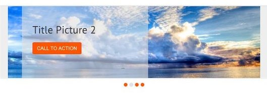
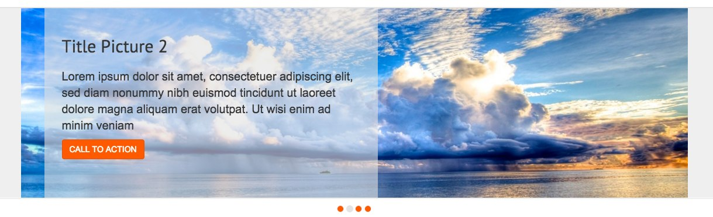

# Pixelant Layout#

Hi, My name is Silvia and I'm a Junior Front End Developer.
In this document I want to explain to you how I organise my work and what type of decisions I make during the developement process.

## What tecnologies do I use?

* HTML5
* CSS3
* TwitterBootstrap
* jQuery
* LessCSS
* Google Fonts
* GitHub

## How do I organise my work?

I use GitHub for two reasons:

1. to split my work into tasks before to start coding
2. to keep trace of my activities by linkng my commits to tasks and branches so the project is open to collaboration

I starte by writing a list of tasks in order to have the overall understanding of the project. Whenever I find a bug, or something that I can improve, I fill a new issue so I don't forget.

This way every commit is a little step forward, and I can work more efficiently. Task after task.

I also create a custom label `wip` that I use to pinpoint my current task. It's very useful for team working but also as self reminder when I start back in the morning.

I do my best to implement GitFlow to organise my job. I produce a new feature branch for each task and I use GitHub to create pull requests to the develop branch. 

Eventually I create a release in the master branch with the version number as tag label. This release is available as a public GitHub Pages project and as downloadable archive:

- [project demo - fix the url!](https://github.com/cibily/Pixelant)
- [download current stable release - fix the url!](https://github.com/cibily/Pixelant)

## Important elements

I try to describe here some tecnical decision that I made. 

### Top Menu Icon

With Bootstrap you can use the Glyphicons but for this layout I used a set on custom Icon. I used Font Face on the custom.css
In the same file I import all the css rules in order to have only one file.

<pre><code>
@font-face {
  font-family: 'icons';      
  src: url('../icons/fonts/icons.eot');
  src: url('./icons/fonts/icons.eot?#iefix') format('embedded-opentype'), 
  url('../icons/fonts/icons.woff') format('woff'), 
  url('./icons/fonts/icons.ttf') format('truetype'), 
  url('./icons/fonts/icons.svg#glyphicons_halflingsregular') format('svg');
}

</code></pre>

### Slide show: 

I created a slideshow with an over background that show you some contents. The contents were not resposive and I decide to use a bootstrap class to hide some element on small and extra small device.

On small device will be visible only the button (like "BUY NOW")

On medium only the title and the button

On mediuam and large all the three elements

### Control Slideshow

The slideshow don't implement a "next" or "prev" icon in the slideshow.
The user can know how many slides exsist and where is it now thank to the rounded controll over the slide show.

  Gray when the slide is active
  
  Orange for the other slide that are not active now

  

 
